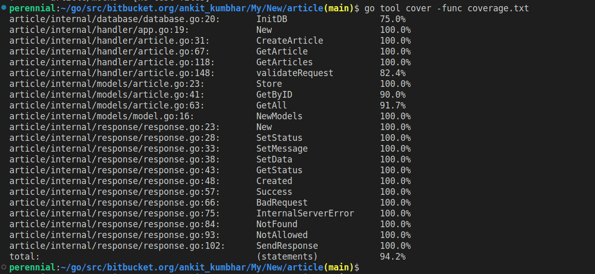

# article
Simple go application to demonstrate REST API for article app

## Packages used
- [go-chi](https://github.com/go-chi/chi)
- [mockery](https://github.com/vektra/mockery)
- [validator](https://github.com/go-playground/validator)

## Setup process

### Running Application
To build and run application simply run

```shell
sh start.sh
```

### Env
To specify custom environment variables make use of `.env` file
```shell
DB_USERNAME=root
DB_PASSWORD=root
DB_HOST=localhost
```

### Testing
Used `testing` package that is built-in in Golang. To run unit tests run following command
```shell
go test -v ./... -cover -coverprofile=coverage.txt
```

To check the coverage run
```shell
go tool cover -func coverage.txt
```

### Coverage:
